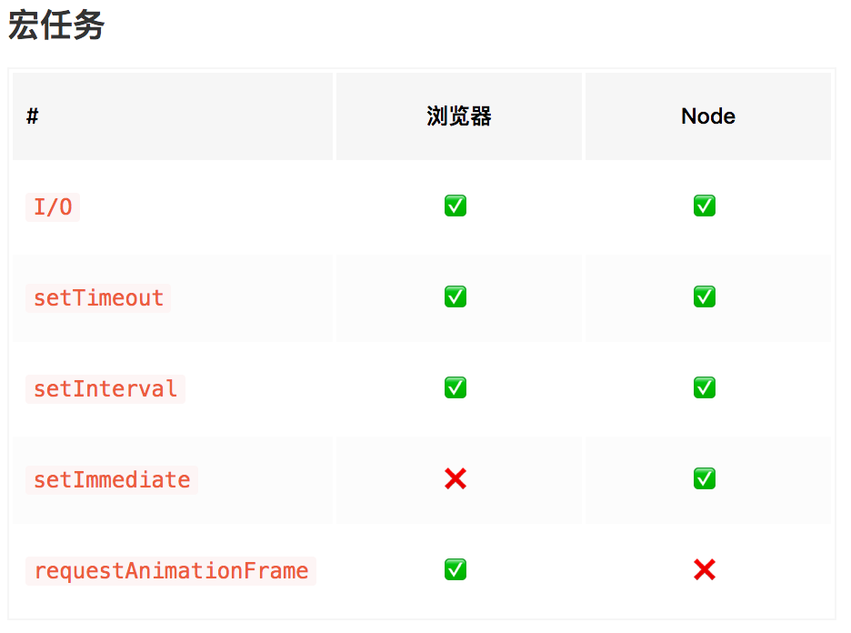
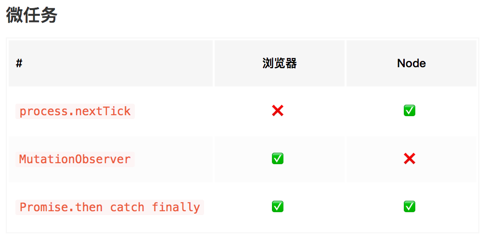
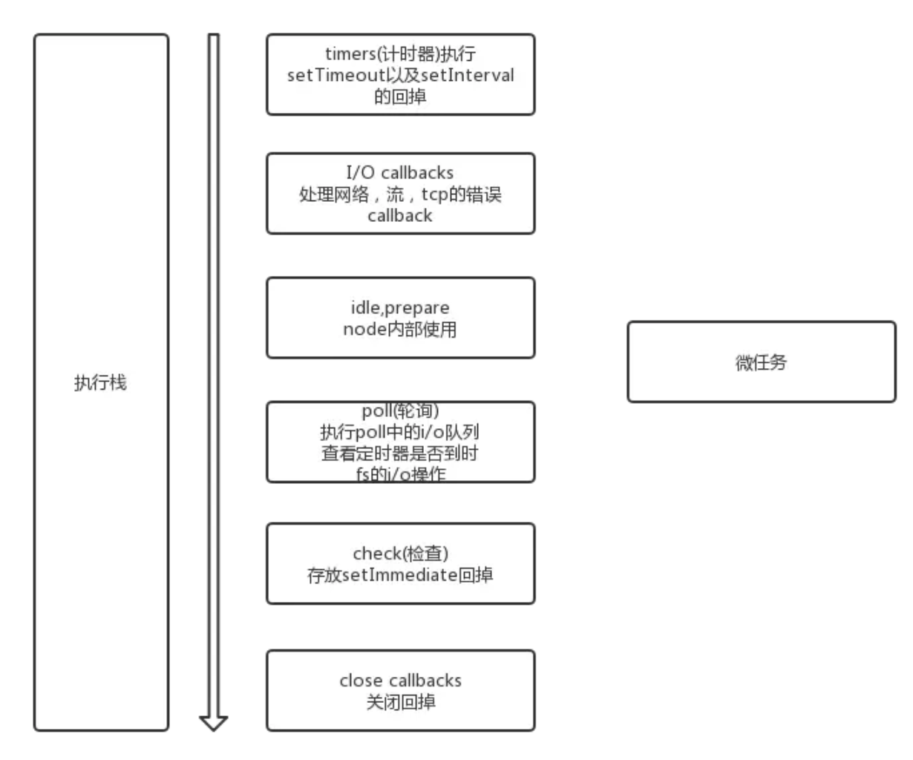

### 前言
**JavaScript是一门单线程的语言**，
所以会从上往下执行代码，
如果在某个代码片段耗时过多，会导致页面卡顿、假死、甚至崩溃。

### 异步
为了解决同步代码可能导致的问题，引入了异步的概念。首先注册一个异步函数，然后告诉主线程什么情况下执行该函数，然后就可以继续往下执行了。比如现实中的点餐，排队办业务等。

### 任务队列
所有的异步任务都会被添加到任务队列中去。

#### 宏任务
宏任务在执行的过程中可以添加微任务。在当前宏任务的微任务没有全部执行完毕前，不会执行下一个宏任务。
```js
setTimeout( _ => console.log(4));

new Promise((resolve, reject) => {
    resolve();
    console.log(1);
}).then(() => {
    console.log(3);
})

console.log(2);
// output: 1, 2, 3, 4
```
所有会进入异步的都是指回调中的那部分代码。所以then()回调中的代码会进入微任务队列中，而实例化Promise对象的时候，是同步执行的，所以会马上输出结果1。

```js
setTimeout(_ => console.log(4));

new Promise(resolve => {
    resolve();
    console.log(1);
}).then(_ => {
    console.log(3);
    Promise.resolve().then(_ => {
        console.log('before timeout');
    }).then(_ => {
        Promise.resolve().then(_ => {
            console.log('also before timeout');
        })
    })
})

console.log(2)
// output: 1, 2, 3, before timeout, also before timeout, 4
```
浏览器和node中属于宏任务的有如下几种


#### 微任务
浏览器和node中属于微任务的有如下几种，其中，Promise的操作都属于微任务操作

因为async/await本质上是对Promise的封装，而Promise是属于微任务的一种，所以在使用await关键字的时候，await下面的效果与Promise.then效果一致，await函数会先执行，然后下面的代码会加入微队列。
```js
setTimeout(_ => console.log(4));

async function main() {
    console.log(1); // 执行
    await say(); // 执行
    console.log(2); // 加入微任务队列
    console.log(5); // 加入微任务队列
}

async function say() {
    console.log(6);
}

main();

console.log(3);
// output: 1, 6, 3, 2, 5, 4 
```
### Node中的差异
node也是单线程，但是在处理event loop上与浏览器稍有不同。单从API上来说，node提供了额外的两个方法：微任务process.nextTick 和 宏任务 setImmediate。node中的事件循环如下图所示：


#### setImmediate
1、setImmediate：当一个宏任务执行完后执行。
2、setTimeout：间隔n秒后执行。

但是如果同时在主线程中执行这两个函数，很难保证哪一个会先执行。因为如果主线程中先注册了两个任务，然后执行代码耗时x秒，而这时定时器处于可执行状态，就会先执行定时器。
但是，加上i/o文件操作以后就会先执行setImmediate，因为setImmediate在i/o文件操作后面的那个阶段执行，执行完setImmediate会在下一个阶段的时候再执行setTimeout（timers计时器阶段）
```js
let fs = require('fs');
fs.readFile('./test.txt', function(){
    console.log('fs');
    setTimeout(function(){
        console.log('setTimeout');
    })
    setImamediate(function(){
        console.log('setImamediate');
    })
});
// output: fs, setImamediate, setTimeout
```

#### process.nextTick
process.nextTick是一个类似于Promise和MutationObserver的微任务，在代码执行的过程中，可以随时添加nextTick，并且会保证在下一个宏任务开始前执行。
```js
process.nextTick(function(){
    console.log('nextTick');
});
setImmediate(function(){
    console.log('setImmediate');
});
// output: // nextTick, setImmediate
```

需要特别注意的是，nextTick的执行在Promise之前
```js
Promise.resolve('123').then(res=>{
   console.log(res);   
});
process.nextTick(() => console.log('nextTick'));
// output: nextTick, 123
```