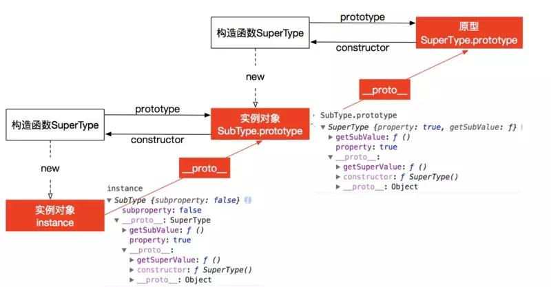

### 前言
继承是实现代码可复用的重要手段

### 原型链继承
- 构造函数、原型和实例之间的关系：**每个构造函数都有一个原型对象，原型对象都包含一个指向构造函数的指针，而实例都包含原型对象的一个指针。**

```js
function SuperType() {
    this.property = true;
}

SuperType.prototype.say = function() {
    console.log(this.property);
}

function SubType() {
    this.subproperty = false;
}

// 创建父类的实例，并将子类的原型对象指向该实例
SubType.prototype = new SuperType();

// 创建子类的实例，此时，实例instance就继承了父类的方法了
let instance = new SubType();
instance.say(); // true;
```

;

> **原型链继承的缺点是对父类中的引用类型数据进行修改会导致所有实例都被篡改。**

```js
function SuperType() {
    this.colors = ['red', 'green', 'blue'];
}

function SubType() {

}

SubType.prototype = new SuperType();

let instance1 = new SubType();
instance1.colors.push('pink');
console.log(instance1.colors); // (4) ["red", "green", "blue", "pink"]

let instance2 = new SubType();
console.log(instance2.colors); // (4) ["red", "green", "blue", "pink"]
// 引用类型值的修改会导致所有实例的值都被同步篡改了
```

### 借用构造函数继承
该方法的核心是**在创建子类实例的时候调用父类构造函数用来实现继承**
```js
function SuperType() {
    this.colors = ['red', 'green', 'blue'];
}

SuperType.prototype.showColors = function() {
    this.colors.forEach((item) => console.log(item));
}

function SubType() {
    // 继承自SuperType，创建子类实例的时候调用父类构造函数，实现继承
    // 只能继承父类实例上的方法和属性，不能继承父类原型链上的方法和实例
    SuperType.call(this);
}

let instance1 = new SubType();
instance1.colors.push('pink');
console.log(instance1.colors); // (4) ["red", "green", "blue", "pink"]
instance1.showColors(); // instance1.showColors is not a function

let instance2 = new SubType();
console.log(instance2.colors); // (3) ["red", "green", "blue"]
instance2.showColors(); // instance2.showColors is not a function
```

该方法的缺点:
- 只能继承父类实例上的方法和属性，不能继承父类原型链上的方法和实例
- 无法实现复用，每个子类都有父类的实例函数的副本，影响性能

### 组合继承
综合原型链和构造函数继续方法，实现组合继承
```js
function SuperType(name) {
    this.name = namel
    this.colors = ['red', 'green', 'blue'];
}

SuperType.prototype.showColors = function() {
    this.colors.forEach((item) => console.log(item));
}

function SubType(name, age) {
    SuperType.call(this, name);
    this.age = age;
}

// 构建新的原型链，此时SubType.prototype的constructor被重写了
SubType.prototype = new SuperType();
// 重写SubType.prototype的构造函数，指向SubType
SubType.prototype.constructor = SubType;

SubType.prototype.getAge = function() {
    return this.age;
}

let instance1 = new SubType('Jhon', 18);
instance1.colors.push('pink');
instance1.showColors();
instance1.getAge();

let instance2 = new SubType('Jack', 20);
instance2.showColors();
instance2.getAge();
```

### 原型式继承
利用一个空对象作为中介，将某个对象直接赋值给空对象构造函数的原型

1、使用Object.create实现继承
2、自定义方法实现
```js
function inherit(obj) {
    let fn = function () {};
    fn.prototype = obj;
    return new fn();
}
```

缺点：
1、无法传参
2、存在属性篡改的可能


### 寄生式继承
返回一个增强的构造函数
```js
function createAnthor(origion) {
    // 创建新对象
    let clone = inherit(origion);
    // 以某种方式来增强对象
    clone.say = function() {
        console.log('hi');
    }
    // 返回增强的对象
    return clone;
}
```
函数的主要作用是为构造函数新增属性和方法，以增强对象

### 寄生混组合式继承
结合借用构造函数和寄生式继承实现继承
```js
function inheritPrototype(subType, superType){
  var prototype = Object.create(superType.prototype); // 创建对象，创建父类原型的一个副本
  prototype.constructor = subType;                    // 增强对象，弥补因重写原型而失去的默认的constructor 属性
  subType.prototype = prototype;                      // 指定对象，将新创建的对象赋值给子类的原型
}

// 父类初始化实例属性和原型属性
function SuperType(name){
  this.name = name;
  this.colors = ["red", "blue", "green"];
}

SuperType.prototype.sayName = function(){
  alert(this.name);
};

// 借用构造函数传递增强子类实例属性（支持传参和避免篡改）
function SubType(name, age){
  SuperType.call(this, name);
  this.age = age;
}

// 将父类原型指向子类
inheritPrototype(SubType, SuperType);

// 新增子类原型属性
SubType.prototype.sayAge = function(){
  alert(this.age);
}

var instance1 = new SubType("xyc", 23);
var instance2 = new SubType("lxy", 23);

instance1.colors.push("2"); // ["red", "blue", "green", "2"]
instance1.colors.push("3"); // ["red", "blue", "green", "3"]
```

### 混入方式继承
Object.assign将一个对象的原型拷贝到另一个对象的原型上实现继承

```js
Object.assign(subType.prototype, superType.prototype);
```

### ES6中的extends继承
```js
class Parent {
    constructor (name) {
        this.name = name;
    }

    getName () {
        return this.name;
    }
}

class Child extends Parent{
    constructor (name, age) {
        // 继承
        super(name);
        this.age = age
    }
}
```

### _inherit
```js
function _inherit(subType, superType) {
    // 增强对象，弥补因重写原型而失去的默认的constructor 属性
    subType.prototype = Object.create(superType && superType.prototype, {
        constructor: {
            value: subType,
            enumerable: false,
            writable: true,
            configurable: true
        }
    });

    if (superType) {
        Object.setPrototypeOf ? Object.setPrototypeOf(subType, superType) : subType.__proto__ = superType;
    }
}
```

### 参考链接
[参考](https://juejin.im/post/5bcb2e295188255c55472db0)
